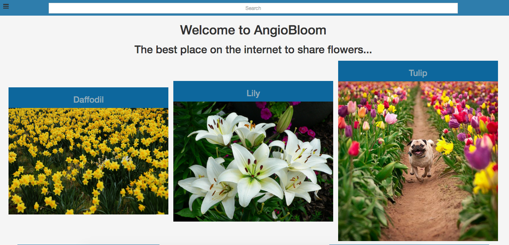
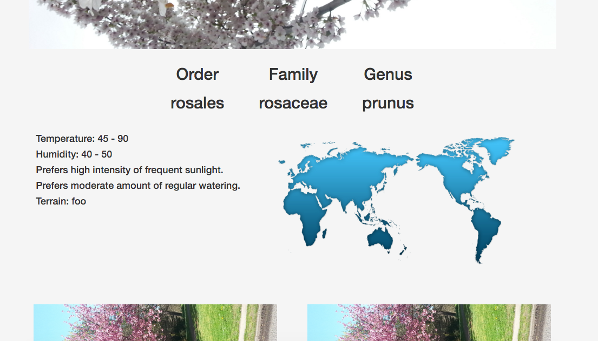
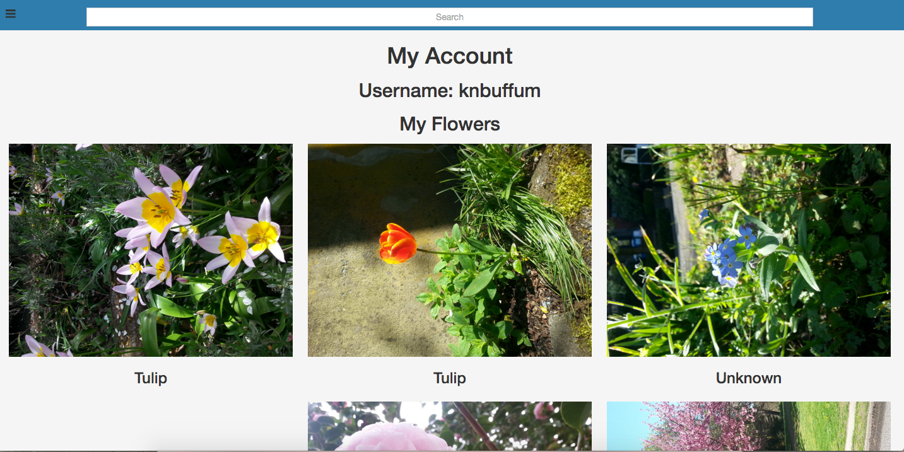
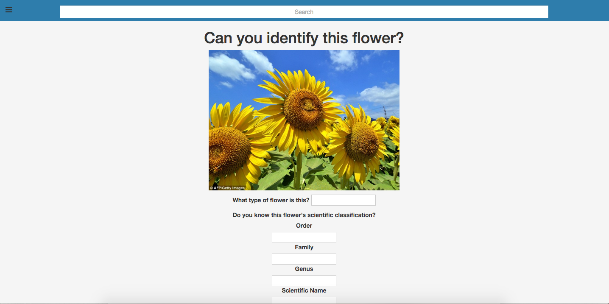

# AngioBloom

This app was inspired by Seattle during Spring. AngioBloom can be used by anyone wishing to upload their flower photos or simply interested in finding out more about flowers.  Users are able to identify their flowers upon upload with information such as the scientific name and water needs.
Starting this app was challenging because I needed to narrow down what features I wanted to implement.  I began by creating user stories and wireframes followed by the ERD.  Once I had a plan I began working on the upload page starting with the backend.  The final day of the project was dedicated to styling, which turned out to be more challenging than I anticipated.  AngioBloom was made using Node, Express, SQL, & Bcrypt.

### Screen Shots

### Wireframes, ERD, & User Stories
* [ERD & User Stories](https://drive.google.com/file/d/0Byyh80k7pOFNRGctSk5na1Rwb2M/view?usp=sharing)
* [WireFrame](https://ninjamock.com/Designer/Workplace)

### Credits
* [Bcrypt.js](https://www.npmjs.com/package/bcryptjs)
* [Bootstrap](getbootstrap.com)
* [Cloudinary](cloudinary.com)
* [Design Little Helpers](http://www.sabinanore.com/design/html-special-symbols/)
* [Express.js](http://expressjs.com)
* [Heroku (for deployment)](http://heroku.com)
* [jQuery](jquery.com)
* [NinjsMock](https://ninjamock.com/)
* [Node.js](http://nodejs.org)

### Major Hurdles
* A challenge I faced was implementing the like buttons.

### Unsolved Problems
* Media Queries are not working

### To be Added
* User points
* Restrictions for editing flower information based on user points
* Map displaying locations of specified flower
